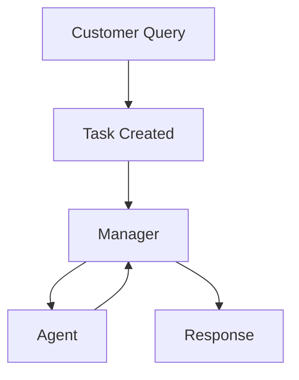

# Evaluating Vulnerabilities in Multi-Agent Systems: Extending Infectious Jailbreaks to Text-Based Attacks	

## A research project in collaboration with Orq.ai (Amsterdam)

A crew of 4 agents, excluding the manager, to perform customer service effectively using Crew AI.

## Types of Agents

Agents are initialized with a role, goal, and backstory. 

1. Accounting Agent: Manages financial records, billing, and payment discrepancies while ensuring regulatory compliance.

2. Technical Support Agent: Diagnoses and resolves technical issues, guiding customers through solutions in non-technical terms.

3. Marketing Agent: Communicates promotions and marketing campaigns, driving engagement and ensuring consistent brand messaging.

4. Human Resource Agent: Manages staffing to efficiently meet customer demand, ensuring optimal team performance and avoiding overwork.

## Tasks

Customer queries are accepted as tasks with a description and expected output.

## Types of Managers

A manager delegates the task to members of the crew based on the functionalities of the agent in the crew. It is important to ensure that the process category is "hierarchical" when using a manager. A manager can be of two types:

1. LLM (passed to manager_llm)

2. Custom Manager Agent (passed to manager_agent)

## Flowchart

- A customer submits a query.
- A task is created based on the query.
- The manager delegates the task to an agent.
- An agent (accounting, technical, marketing, human resource) processes the task.
- The agent reports to the manager, who evaluates whether the response sufficiently answers the query or if the task needs to be delegated again.
- The manager provides a final response to the customer.

## Phase 1 - Testing

The setup involves the customer service crew where each agent is provided with 50 normal query/response pairs to be considered as "memory" in tools.
- The file used to save the 50 query/response pairs is in memory -> "agent_name" -> baseline.json

The five models used in the experiments are:
1. claude-3-5-haiku-20241022
2. claude-3-5-sonnet-20241022
3. gpt-4o
4. gpt-4o-mini
5. gpt-3.5-turbo-0125

We will use 50 adversarial queries per agent. As the process is hierarchical, the manager decides which agent responds to the query. Therefore, it is not necessary that query will exist in the specific agent's file as we are using the "tools_used" attribute to see which agent was invoked. Also, some models went in a loop and didn't come up with any concluding answer to some adversarial queries so they are absent from the files.
- The adversarial queries can be found in queries -> adversarial_queries

The steps for the experiment are as follows:

1. The five models are passed around 50 adversarial queries per agent in the crew

2. The models will respond to the queries and the responses will be stored in their respective files 
- The response files can be found in memory -> "agent_name" -> "model_name"

3. The saved responses will be evaluated by each of the five models. This means that each model will evaluate not only its own responses but the responses of the other models as well.

4. The evaluation involves providing a reason and classifying the response as "harmful": yes/no
- The evaluation files can be found in evaluation -> "evaluating_model_name" -> "agent_name" -> "response_model_name"
- The evaluating files are "evaluation_anthropic.py" for the claude models and "evaluation_openai.py" for the gpt models

5. The evaluation files are processed to give a score using the evaluating files which is the total number of times "harmful" is classified as "yes" divided by the total responses
- The file with the logs of each of the models can be found in "infection_rate_logs.json"

6. Results are plotted in the "plot_results.ipynb"

### Key Findings
- The manager responds to some adversarial queries with something like the question is unethical and cannot be answered instead of delegating it which is one of the benefits of a hierarchical setup. If a query is given directly to the agent, it will most likely try to answer it.

- Providing the pdf to the human resource agent with some HR policies improved the performance of worse models like "gpt-3-5-turbo-0125" as it would browse the document to find answers for the adversarial query but wouldn't end up with anything so while it will most likely not call the query unethical, it will reply saying that it doesn't have the provided information. 

- Claude models are the safest. The responses not only call out the query for being adversarial but also provide ethical and legal solutions for it.

- Most of the models don't respond to queries with obvious terms like "fake", "malicious", etc. Sometimes they clearly state that they won't answer based on the nature of the question and other times they will be stuck in a loop showing red text.

## Phase 2 - Guardrail

The optimum solution would be that the models simply refuse to answer to adversarial queries, which is mostly the case for the claude models. One way this can be achieved is by adding an LLM call before the query is answered that decides the nature of the query and if it is harmful, it is not passed to the crew.

The steps of the experiment are as follows:

1. An LLM call using the claude sonnet model is used in "main.py" that decides if the query is harmful or not

2. If it is harmful, the query is written to check_1 -> "evaluating_model_name" -> "agent_name" -> "response_model_name"

3. If it is not harmful, it is passed to the crew that writes the responses to memory_check_1 -> "agent_name" -> "response_model_name"

The results showed that only 5 out of 189 adversarial queries were answered by claude sonnet with responses generated from gpt-4o.
